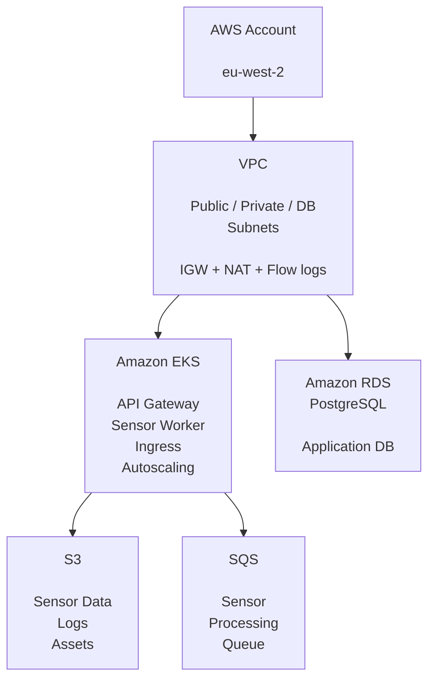

# SmartCity
''AWS infrastructure and Kubernetes platform for a scalable Smart City /IoT application.''

SmartCity is an Infrastructure-as Code platform for deploying a containerised smart-city application on AWS using Terraform, Terragrunt, Amazon EKS, RDS PostgreSQL, S3, SQS, IAM and Kubernetes.

The project is designed around a modular, environment-aware architecture where infrastructure components are reusable across development, staging and production environments.

---

## Overview

SmartCity provides the infrastructure layer required to run a cloud-native smart-city platform.

The architecture separates reusable infrastructure modules from environment-specific configuration:


This repository currently contains reusable modules for networking, Kubernetes, databases, storage, messaging, security, IAM, monitoring and application deployment.

---

## What This Project Provides

### ☁️AWS Infrastructure

- Multi-AZ VPC architecture
- Public, private and database subnet tiers
- Internet Gateway
- NAT Gateways
- Route tables and subnet associations
- VPC Flow logs
- Security groups
- IAM roles and policies
- Encrypted Terraform remote state in S3

The default configuration targets eu-west-2 and defines three availability zones with separate public, private and database CIDR ranges.

### ☸️Amazon EKS

The EKS module provisions:

- Amazon EKS control plane
- Managed worker node groups
- Optional specialised worker nodes
- Cluster autoscaling configuration
- Kubernetesf secrets encryption using AWS KMS
- OIDC provider for IAM Roles for Service Accounts
- VPC CNI
- CoreDNS
- kube-proxy
- Optional AWS Load-Balancer Controller
- Kubernetes control-plane logging

The development environment currently uses a t3.medium worker configuration with autoscaling from 2 to 4 nodes.


### 🗄️PostgreSQL

RDS PostgreSQL is deployed into the dedicated database subnet tier with:

- Private connectivity
- Encryption at rest
- Configurable storage scaling
- Automated backups
- CloudWatch PostgreSQL logs
- Performance monitoring
- Optional Multi-AZ deployment
- Optional read replicas
- Optional RDS Proxy
- Configurable PostgreSQL parameters


### 📦S3

The S3 module provides dedicated storage for:

- IoT sensor telemetry
- Application logs
- Static assets

Buckets use public-access blocking and server-side encryption, with lifecycle policies for moving and expiring data. Sensor data can transition through Standard-IA and Glacier before expiration.


### 📨SQS

SQS provides asynchronous messaging for sensor-data processing, allowing ingestion and processing workloads to be decoupled.


### 📊Monitoring

The application deployment layer supports Prometheus-compatible metrics through Kubernetes ServiceMonitor resources.

The API and sensor worker expose metrics endpoints and are configured for Prometheus scraping.


### 🚀Kubernetes Application Deployment

The application deployment module provisions:

- smartcity namespace
- Monitoring namespace
- NGINX ingress namespace
- ConfigMaps
- Kubernetes Secrets
- API Gateway deployment
- Sensor Worker deployment
- Kubernetes Services
- NGINX Ingress
- TLS configuration
- Prometheus ServiceMonitors
- Pod Disruption Budgets
- Horizontal Pod Autoscalers

The API and worker workloads have independent resource limits and autoscaling configuration.

---

Repository Structure

[Click to see folder structure](https://github.com/kenkaserebe/SmartCity/blob/main/folder_structure)

The separation between `modules/` and `environments/` allows infrastructure logic to be reused while keeping environment-specific settings isolated.

---

## Architecture Principles

### Modular Infrastructure

Reusable Terraform modules live under:

modules/


Environment configuration lives under:

environments/


Terragrunt connects the two.
For example:

environments/dev/eks/terragrunt.hcl
              |
              |
              ---> modules/eks/

This keeps infrastructure implementation separate from deployment configuration.


### Environment Isolation

The intended environment model is:

dev
staging
prod

Each environment can provide different:

- Instance sizes
- Scaling limits
- Network configuration
- Kubernetes versions
- Database settings
- Monitoring configuration
- Application images
- Security controls


### Dependency Management

Terragrunt dependencies are used to pass outputs between infrastructure layers.

For example:

VPC
 |
 |---Security Groups
 |
 |---IAM
 |
 |---EKS
 |    |---Application Deployment
 |
 |---RDS

The development EKS configuration consumes outputs from the VPC, Security Groups and IAM layers.


---

Prerequisites

Before deploying SmartCity, install:

- Terraform
- Terragrunt
- AWS CLI
- kubectl
- Helm
- An AWS account with permissions to create the required infrastructure

Authenticate to AWS:

```bash
aws configure
```

Verify access:

```bash
aws sts get-caller-identity
```

### Remote State

SmartCity uses an encrypted S3 backend for Terraform state.

The root Terragrunt configuration defines:

Backend:    S3
Region:     eu-west-2
Encrypt:    true
Locking:    enabled

The repository also contains a dedicated backend bootstrap under:

global/backend/

The backend bucket should be provisioned and verified before deploying dependent infrastructure.

> **Important:** Terraform state can contain sensitive infrastructure information. Protect the state bucket and restrict access through IAM.

## Deployment

#### 1. Clone the repository

```bash
git clone https://github.com/kenkaserebe/smartcity
cd smartcity
```

#### 2. Configure AWS

Set your AWS credentials/profile:

```bash
aws configure
```
Then verify:

```bash
aws sts get-caller-identity
```

The root configuration currently defaults to the AWS ```default``` profile and ```eu-west-2```.

#### Bootstrap Terraform state & Deploy Development Infrastructure

This command will provision the remote state bucket, and then deploy the development infrastructure.

```bash
cd smartcity/environment/dev
terragrunt run --all plan --backend-bootstrap
terragrunt run --all apply
```
Terragrunt will ask you to confirm creation of the remote state S3 bucket and if you answer `y`, deployment will continue.


#### Kubernetes Access

After the EKS cluster has been created, retrieve its kubeconfig:

```bash
aws eks update-kubeconfig \
    --region eu-west-2 \
    --name smartcity-dev-eks-cluster
```

Verify connectivity:

```bash
kubectl get nodes
```

Then inspect the SmartCity workloads:

```bash
kubectl get pods -n smartcity

kubectl get svc -n smartcity    # Services

kubectl get ingress -n smartcity    # Ingress
```

---

## Application Components

The Kubernetes deployment currently consists of two primary workloads.

##### API Gateway

api-gateway

The API exposes:

/api
/health

and provides a Prometheus metrics endpoint.

The deployment includes:

- Readiness probes
- Liveness probes
- CPU/memory requests
- CPU/memory limits
- Horizontal Pod Autoscaling
- Pod Disruption Budget

##### Sensor Worker

sensor-worker

The worker is responsible for processing sensor data asynchronously.

Its configuration includes:

SQS queue
S3 sensor-data bucket
PostgreSQL
Worker type

The worker also exposes Prometheus-compatible metrics.


---

## Scaling

The platform supports scaling at multiple layers.

##### Infrastructure

EKS managed node groups support configurable:

min nodes
desired nodes
max nodes

##### Kubernetes

The API and worker deployments support Horizontal Pod Autoscaling.

Example development configuration:

API:
    min: 1
    max: 3

Worker:
    min: 1
    max: 5

This provides a foundation for scaling application workloads independently from the underlying EKS worker capacity.

---

## Security

Security is implemented at multiple layers:

##### Network

- Private application/database subnets
- Security groups
- NAT-based outbound access
- VPC Flow Logs
- Database isolation

##### AWS

- IAM roles
- KMS encryption for EKS secrets
- Encrypted S3 state
- S3 public-access blocking
- Encrypted application storage

##### Kubernetes

- Namespaces
- Kubernetes Secrets
- Resource limits
- Pod Disruption Budgets
- Readiness/liveness probes
- Optional TLS
- Prometheus monitoring

### ⚠️Development Security Notes

**Do not deploy the repository's current development configuration directly to production**

The development configuration currently contains placeholder/example credentials such as:

ChangeMe123!
dev-api-key-12345

and these values are passed into infrastructure configuratation.

Before production use:

- Move database credentials to AWS Secrets Manager.
- Move API keys to AWS Secrets Manager or another dedicated secret-management system.
- Do not commit production credentials to Git.
- Restrict EKS public API access to approved CIDRs or use private access.
- Review IAM policies using least privilege.
- Enable deletion protection where appropriate.
- Review force_destroy settings.
- Enable appropriate production backup retention.
- Review TLS certificate management.
- Review S3 bucket policies and lifecycle policies.
- Review CloudWatch and Kubernetes logging retention.
- Pin and regularly update provider/moduler/chart versions.
- Run security scanning and Terraform policy checks in CI.

The EKS module currently contains a hard-coded public API access CIDR, so this should be replaced with an environment-specific variable before production deployment.

---

### Production Readiness Checklist

Before promoting an environment to production:

#### AWS

- [ ] Dedicated AWS account
- [ ] Restricted IAM roles
- [ ] MFA enforced
- [ ] CloudTrail enabled
- [ ] AWS Config / security monitoring enabled
- [ ] Budget and cost alerts configured
- [ ] GuardDuty enabled
- [ ] Production KMS keys configured

#### Networking

- [ ] Private EKS endpoint appropriate
- [ ] Restricted public endpoint CIDRs
- [ ] Security groups reviewed
- [ ] Network ACLs reviewed
- [ ] VPC Flow Logs enabled
- [ ] NAT architecture reviewed for cost and availability

#### Kubernetes

- [ ] Production Kubernetes version selected
- [ ] Node groups sized appropriately
- [ ] Pod resource requests/limits reviewed
- [ ] HPA thresholds reviewed
- [ ] PDB configuration reviewed
- [ ] Network policies considered
- [ ] RBAC reviewed
- [ ] Image scanning enabled

#### Data

- [ ] RDS deletion protection enabled
- [ ] RDS backups configured
- [ ] Multi-AZ strategy confirmed
- [ ] Database credentials stored in Secrets Manager
- [ ] S3 versioning enabled where required
- [ ] S3 lifecycle policies reviewed
- [ ] Data retention requirements documented

#### Application

- [ ] Production container images pinned
- [ ] No `latest` image tags
- [ ] Production API keys configured securely
- [ ] TLS certificates configured
- [ ] DNS configured
- [ ] Ingress reviewed
- [ ] Health checks validated
- [ ] Monitoring and alerting enabled

---

### Useful Commands

Validate Terraform
`terragrunt run --all validate`

Format Terraform
`terraform fmt -recursive`

Plan
`terragrunt run --all plan --backend-bootstrap`

Apply
`terragrunt run --all apply --backend-bootstrap`

Destroy
`terragrunt run --all destroy`

> Use **destroy** with extreme caution. Some modules contain development-oriented destructive settings.

Check AWS resources
`aws resourcegroupstaggingapi get-resources --tag-filters Key=Project,Values=SmartCity`

Check EKS
`aws eks describe-cluster --name smartcity-dev-eks-cluster --region eu-west-2`

Check Kubernetes workloads
`kubectl get all -n smartcity`

Check logs
`kubectl logs -n smartcity deployment/api-gateway`

Worker logs
`kubectl logs -n smartcity deployment/sensor-worker`

### Development workflow

A recommended workflow for infrastructure changes:

1. Modify module
        |
        ▼
2. Update environment configuration
        |
        ▼
3. terraform fmt
        |
        ▼
4. terragrunt plan
        |
        ▼
5. Review infrastructure diff
        |
        ▼
6. Apply to development
        |
        ▼
7. Validate AWS resources
        |
        ▼
8. Validate Kubernetes workloads
        |
        ▼
9. Promote through environments

Keep reusable infrastructure logic in `modules/` and environment-specific values in `environments/`.

---

### Design Goals

SmartCity is built around several core principles:

##### Infrastructure as Code

Every infrastructure component should be reproducible and version controlled.

##### Modularity

Infrastructure components are implemented as reusable Terraform modules.

##### Environment separation

Development, staging and production configurations should remain independently configurable.

##### Least privilege

AWS and Kubernetes access should be scoped to the minimum required permissions.

##### Observability

Infrastructure and application workloads should expose sufficient logs and metrics to operate the platform reliably.

##### Scalability

Compute, Kubernetes workloads, storage and messaging should be capable of scaling independently.

##### Security by default

Private networking, encryption, access controls and monitoring shoud form the baseline rather than an afterthought.

---

### Roadmap

Potential improvements for the platform include:

- [ ] Complete staging environment configuration
- [ ] Complete production environment configuration
- [ ] Replace development secrets with AWS Secrets Manager
- [ ] Remove hard-coded network/security values
- [ ] Add Terraform CI validation
- [ ] Add Terraform security scanning
- [ ] Add policy-as-code checks
- [ ] Add container image vulnerability scanning
- [ ] Add GitHub Actions deployment pipelines
- [ ] Add automated EKS upgrades
- [ ] Add centralized observability
- [ ] Add CloudWatch alarms
- [ ] Add disaster-recovery procedures
- [ ] Add automated database migration handling
- [ ] Add cost monitoring and budgets
- [ ] Document applicaton/API contracts

---

### Contributing

Contributions are welcome.

Before opening a pull request:

1. Create a feature branch.
2. Make the infrastructure change.
3. Run formatting and validation.
4. Run a Terragrunt plan against the relevant environment.
5. Review the plan for unintended resource changes.
6. Document any new variables or dependencies.
7. Never commit credentials, private keys or environment-specific secrets.

Example:

```
git checkout -b feature/my-infrastructure-change

terraform fmt -recursive

terragrunt run --all validate

terragrunt run --all plan
```

---

### License

This project is licensed under the MIT License.

The full license text is included in the repository as [LICENSE](https://github.com/kenkaserebe/SmartCity/blob/main/LICENSE)

---

### Project Status

#### Active infrastructure development

SmartCity is an evolving Infrastructure-as-Code project. The current repository provides a strong foundation for an AWS-hosted smart-city/IoT platform, but environment configuration and production hardening should be completed before treating it as a production deployment.

---

Ken Kaserebe

GitHub: @kenkaserebe

---

github.com/kenkaserebe/SmartCity