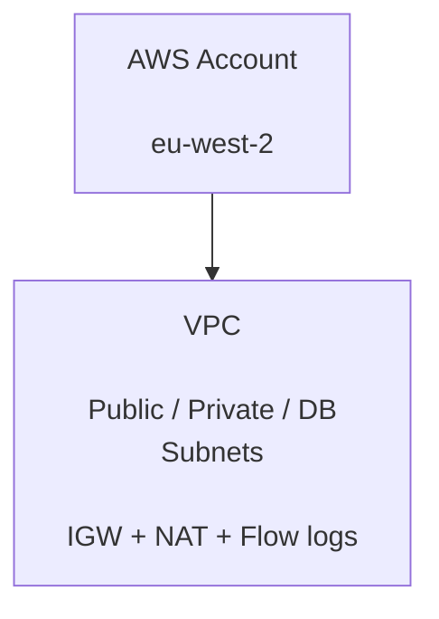

# SmartCity
''AWS infrastructure and Kubernetes platform for a scalable Smart City /IoT application.''

SmartCity is an Infrastructure-as Code platform for deploying a containerised smart-city application on AWS using Terraform, Terragrunt, Amazon EKS, RDS PostgreSQL, S3, SQS, IAM and Kubernetes.

The project is designed around a modular, environment-aware architecture where infrastructure components are reusable across development, staging and production environments.

---

## Overview

SmartCity provides the infrastructure layer required to run a cloud-native smart-city platform.

The architecture separates reusable infrastructure modules from environment-specific configuration:

---

