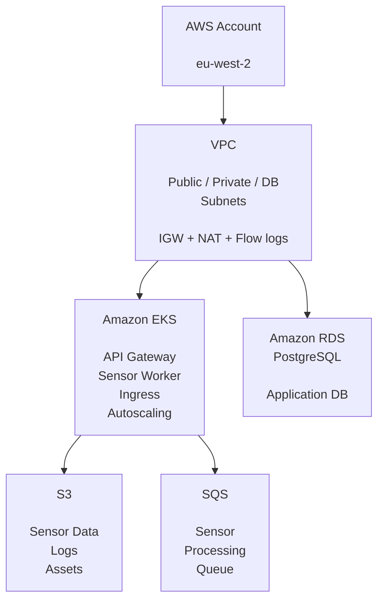

# SmartCity
''AWS infrastructure and Kubernetes platform for a scalable Smart City /IoT application.''

SmartCity is an Infrastructure-as Code platform for deploying a containerised smart-city application on AWS using Terraform, Terragrunt, Amazon EKS, RDS PostgreSQL, S3, SQS, IAM and Kubernetes.

The project is designed around a modular, environment-aware architecture where infrastructure components are reusable across development, staging and production environments.

---

## Overview

SmartCity provides the infrastructure layer required to run a cloud-native smart-city platform.

The architecture separates reusable infrastructure modules from environment-specific configuration:


This repository currently contains reusable modules for networking, Kubernetes, databases, storage, messaging, security, IAM, monitoring and application deployment.

---

## What This Project Provides

### ☁️AWS Infrastructure

- Multi-AZ VPC architecture
- Public, private and database subnet tiers
- Internet Gateway
- NAT Gateways
- Route tables and subnet associations
- VPC Flow logs
- Security groups
- IAM roles and policies
- Encrypted Terraform remote state in S3

The default configuration targets eu-west-2 and defines three availability zones with separate public, private and database CIDR ranges.

### ☸️Amazon EKS

The EKS module provisions:

- Amazon EKS control plane
- Managed worker node groups
- Optional specialised worker nodes
- Cluster autoscaling configuration
- Kubernetesf secrets encryption using AWS KMS
- OIDC provider for IAM Roles for Service Accounts
- VPC CNI
- CoreDNS
- kube-proxy
- Optional AWS Load-Balancer Controller
- Kubernetes control-plane logging

The development environment currently uses a t3.medium worker configuration with autoscaling from 2 to 4 nodes.


### 🗄️PostgreSQL

RDS PostgreSQL is deployed into the dedicated database subnet tier with:

- Private connectivity
- Encryption at rest
- Configurable storage scaling
- Automated backups
- CloudWatch PostgreSQL logs
- Performance monitoring
- Optional Multi-AZ deployment
- Optional read replicas
- Optional RDS Proxy
- Configurable PostgreSQL parameters


### 📦S3

The S3 module provides dedicated storage for:

- IoT sensor telemetry
- Application logs
- Static assets

Buckets use public-access blocking and server-side encryption, with lifecycle policies for moving and expiring data. Sensor data can transition through Standard-IA and Glacier before expiration.


### 📨SQS

SQS provides asynchronous messaging for sensor-data processing, allowing ingestion and processing workloads to be decoupled.


### 📊Monitoring

The application deployment layer supports Prometheus-compatible metrics through Kubernetes ServiceMonitor resources.

The API and sensor worker expose metrics endpoints and are configured for Prometheus scraping.


### 🚀Kubernetes Application Deployment

The application deployment module provisions:

- smartcity namespace
- Monitoring namespace
- NGINX ingress namespace
- ConfigMaps
- Kubernetes Secrets
- API Gateway deployment
- Sensor Worker deployment
- Kubernetes Services
- NGINX Ingress
- TLS configuration
- Prometheus ServiceMonitors
- Pod Disruption Budgets
- Horizontal Pod Autoscalers

The API and worker workloads have independent resource limits and autoscaling configuration.

---

Repository Structure

[Click to see folder structure](https://github.com/kenkaserebe/SmartCity/blob/main/folder_structure)

The separation between `modules/` and `environments/` allows infrastructure logic to be reused while keeping environment-specific settings isolated.

---

## Architecture Principles

### Modular Infrastructure

Reusable Terraform modules live under:

modules/


Environment configuration lives under:

environments/


Terragrunt connects the two.
For example:

environments/dev/eks/terragrunt.hcl
              |
              |
              ---> modules/eks/

This keeps infrastructure implementation separate from deployment configuration.


### Environment Isolation

The intended environment model is:

dev
staging
prod

Each environment can provide different:

- Instance sizes
- Scaling limits
- Network configuration
- Kubernetes versions
- Database settings
- Monitoring configuration
- Application images
- Security controls


### Dependency Management

Terragrunt dependencies are used to pass outputs between infrastructure layers.

For example:

VPC
 |
 |---Security Groups
 |
 |---IAM
 |
 |---EKS
 |    |---Application Deployment
 |
 |---RDS

The development EKS configuration consumes outputs from the VPC, Security Groups and IAM layers.


---

Prerequisites

Before deploying SmartCity, install:

- Terraform
- Terragrunt
- AWS CLI
- kubectl
- Helm
- An AWS account with permissions to create the required infrastructure

Authenticate to AWS:

```bash
aws configure
```

Verify access:

```bash
aws sts get-caller-identity
```

### Remote State

SmartCity uses an encrypted S3 backend for Terraform state.

The root Terragrunt configuration defines:

Backend:    S3
Region:     eu-west-2
Encrypt:    true
Locking:    enabled

The repository also contains a dedicated backend bootstrap under:

global/backend/

The backend bucket should be provisioned and verified before deploying dependent infrastructure.

> **Important:** Terraform state can contain sensitive infrastructure information. Protect the state bucket and restrict access through IAM.